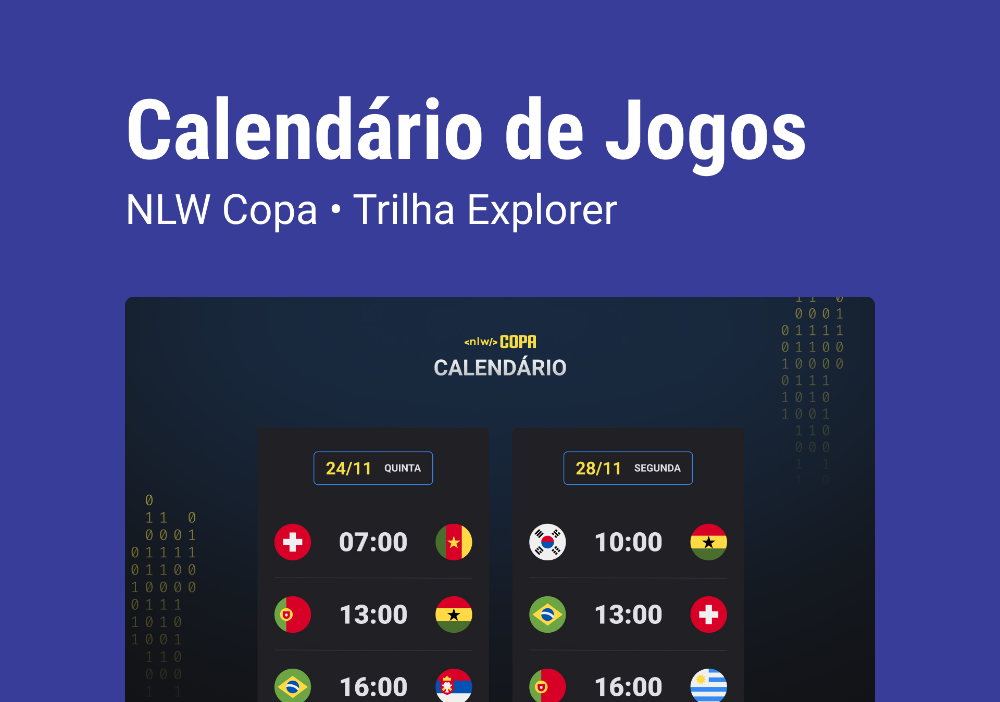

<h1 align="center">NLW #10 copa </h1>

  Evento exclusivo e gratuito, promovido pela Rocketseat para ensino de tecnologias WEB

  <a href="#tecnologias"> Tecnologias </a>&nbsp;&nbsp;&nbsp;|&nbsp;&nbsp;&nbsp;
  <a href="#projeto"> Projeto </a>&nbsp;&nbsp;&nbsp;|&nbsp;&nbsp;&nbsp;
  <a href="#layout"> Layout </a>&nbsp;&nbsp;&nbsp;|&nbsp;&nbsp;&nbsp;
  <a href="#memo-licença"> Licença </a>&nbsp;&nbsp;&nbsp;|&nbsp;&nbsp;&nbsp;

  

  

## Tecnologias

Esse projeto foi desenvolvido com as seguintes tecnologias:

- HTML e CSS
- JavaScript
- Git e GitHub

## Projeto

O Calendário da Copa é um projeto que mostra os jogos da Copa de 2022.

## Layout

Você pode visualizar o layout do projeto através [DESSE LINK](https://www.figma.com/file/J1Z33MISC22YZB8wfxiIns/NLW-Copa-Explorer/duplicate).

## :memo: Licença

Esse projeto está sob a licença MIT.

---

Feito com ♥ by Ítalo César :wave: 
